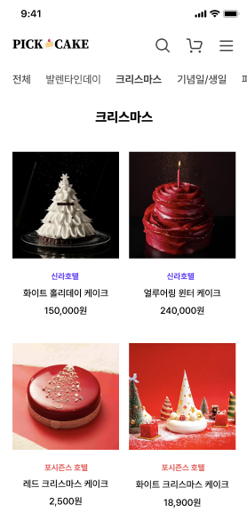
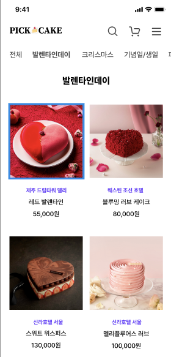
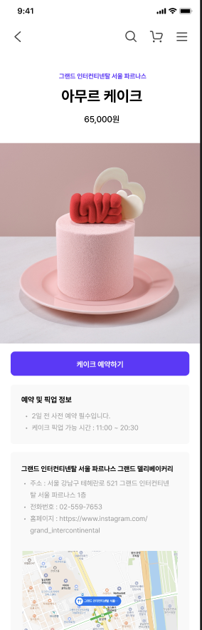

# Pick Cake App

-----
###  케이크 및 이벤트 상품 큐레이션 서비스

> 크리스마스, 발렌타인.. 특별한 날, 특별한 케이크로 기념하고 싶은 사람들을 위한 
> 호텔 케이크와 각종 이벤트 그리고 팝업 상품을 소개하고 예약하는 앱 서비스

| 사용 기술 스택                                           | 기간| 역할|            |
|----------------------------------------------------|--|---|------------|
| java, spring boot, redis, mariadb, docker, asyncio | 2024.01.01~2024.03.15| 백엔드 개발| @hail-cali |
 

---------
[개발 내역]
1. 조회 서비스 api
   - 상품 조회, 필터 별 조회, 상품 상세 조회 api 개발
   - 네이버, 카카오, 구글 api 연동 기능 개발

2. 이미지 서버 api [`이미지 로딩에 대해 api 분리 개발`] 
    - 이미지에 대한 메타데이터는 상품이 업로드 될 때 함께 dml 을 날리도록 설계
    - file-system 에 이미지가 카피하는 api 로 분리 설계

3. 테스트 보일러 플레이트 및 컨테이너 환경 테스트 추가
   - 테스트의 유닛 단위 정합성 보장과 반복되는 테스트 코드를 줄이기 위한 목적으로 개발
   - 메서드 단위 트랜잭션을 사용해야 하며 테스트 클래스에 대한 자체 테스트 및 트랜잭션 관련 테스트 추가 

4. spring security 추가 및 회원 관련 개발
   - 쿠키, 세션 관리 기능 추가
   - http 에러 핸들링 추가 개선
   - 메서드별 security 적용

5. 컨테이너 환경 서비스 배포
   - maria db 
   - redis 기능 추가

6. text generation api 연동한 케이크 추천 시스템 콘텐츠 기능 개발
   - chat GPT engine api 연동 

----

[추후 개선 사항]
- jpa 최적화 및 리팩토링                           [-] : 예정
- redis 대규모 리펙토링 및 버그 픽스                  [-] : 예정
- 추천 시스템 관련 기능 개발 건                      [v] : 1차 완료
- 예약 서비스 관련 로직 리팩토링, 테스트 후 추가 예정     [v] : pending
- 소셜 로그인  2주 내 개발 예정                     [x] : pending
- 이미지 서버 api 관련 추가 기능 개선 건              [x] : pending

----
[서비스 화면]

 

 

